# AI-OpenCog Architecture Diagrams

This document provides detailed architectural diagrams for the AI-OpenCog system, with comprehensive explanations of each component and interaction pattern.

## Table of Contents

1. [System Overview](#system-overview)
2. [Agent Interaction Patterns](#agent-interaction-patterns)
3. [Learning and Adaptation Flow](#learning-and-adaptation-flow)
4. [Knowledge Management Architecture](#knowledge-management-architecture)
5. [Reasoning Engine Architecture](#reasoning-engine-architecture)
6. [Real-Time Processing Pipeline](#real-time-processing-pipeline)
7. [User Behavior Learning System](#user-behavior-learning-system)
8. [Production Monitoring Architecture](#production-monitoring-architecture)

## System Overview

### High-Level Component Interaction

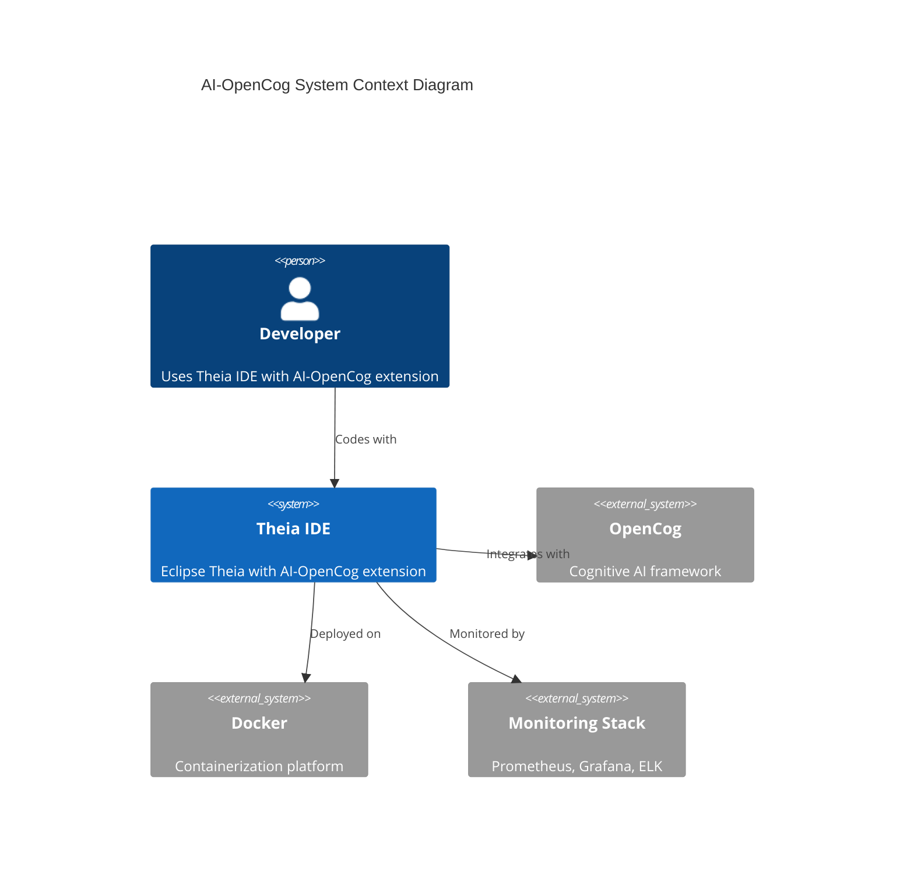

### Component Hierarchy

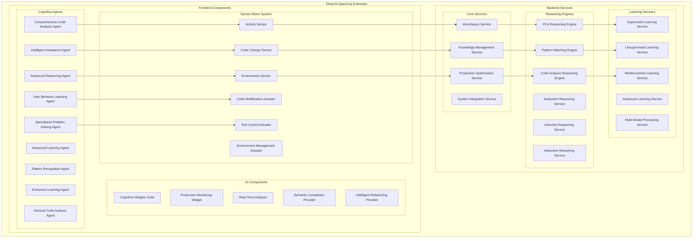

## Agent Interaction Patterns

### Cognitive Agent Collaboration

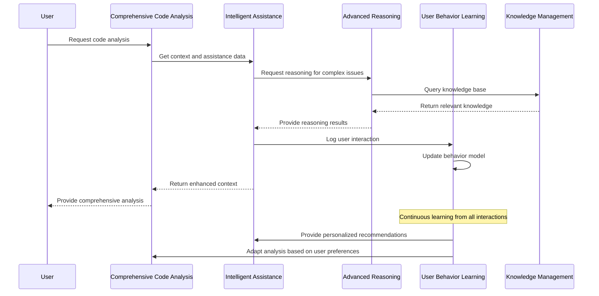

### Agent State Management

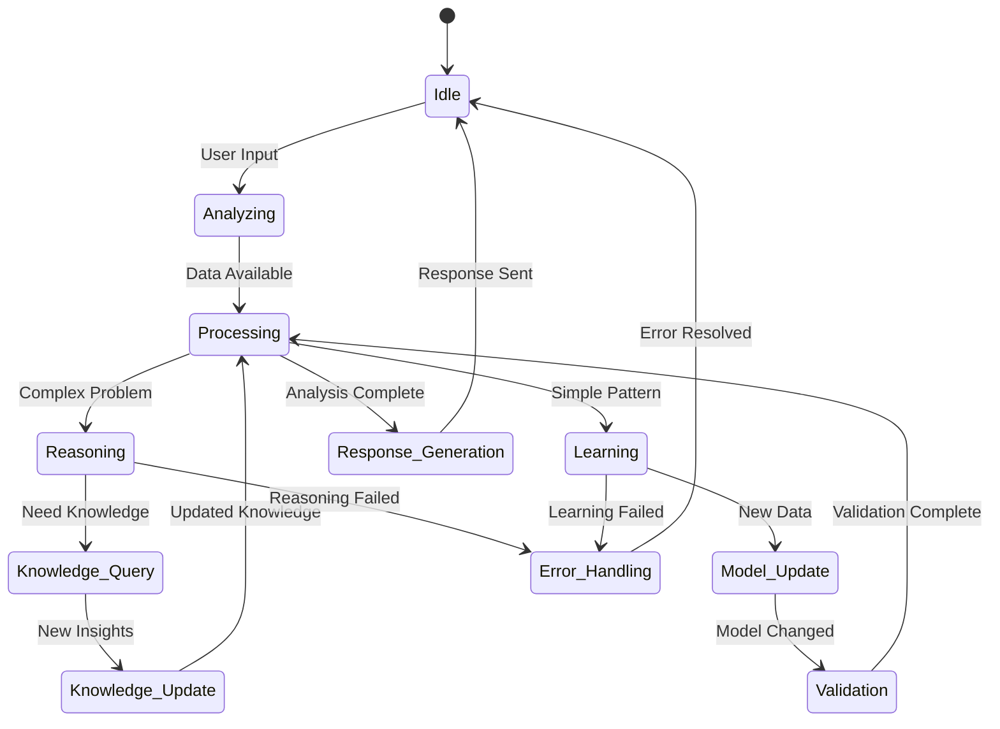

## Learning and Adaptation Flow

### Continuous Learning Pipeline

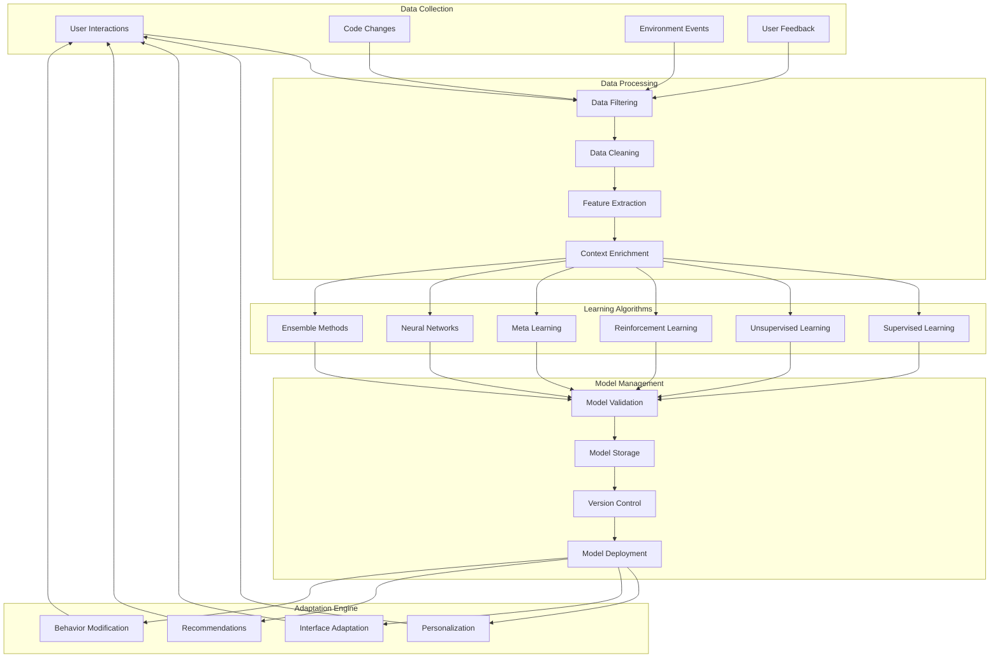

### Adaptation Strategy Selection

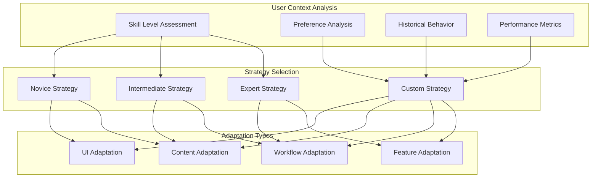

## Knowledge Management Architecture

### Knowledge Graph Structure

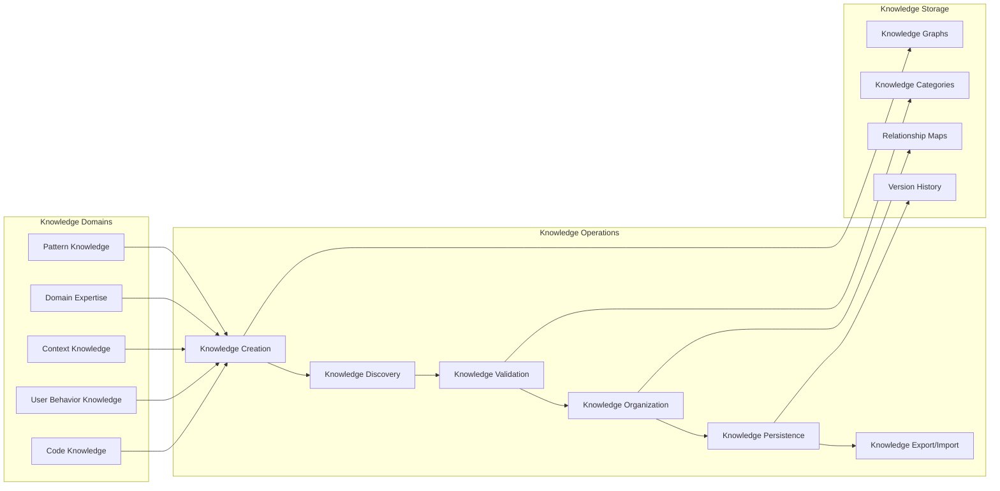

### AtomSpace Integration

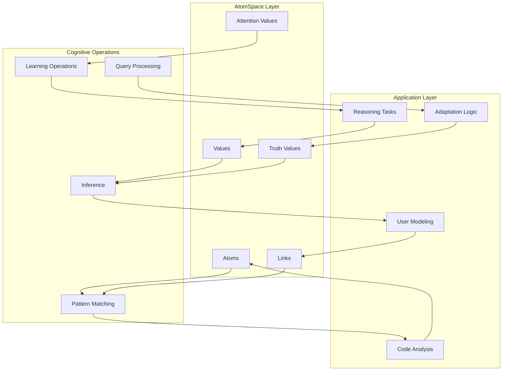

## Reasoning Engine Architecture

### Multi-Engine Reasoning System

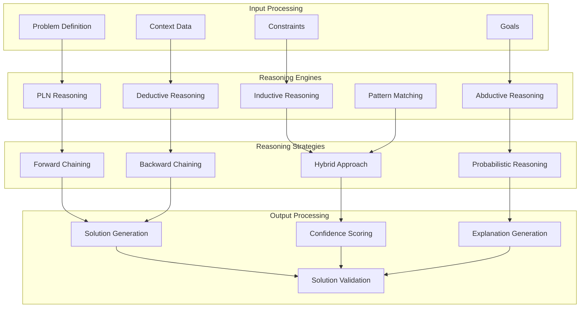

### Code Analysis Reasoning Flow

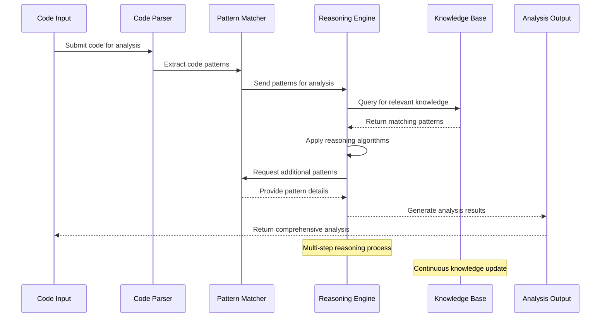

## Real-Time Processing Pipeline

### Live Code Analysis

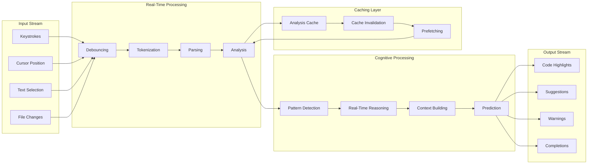

### Performance Optimization

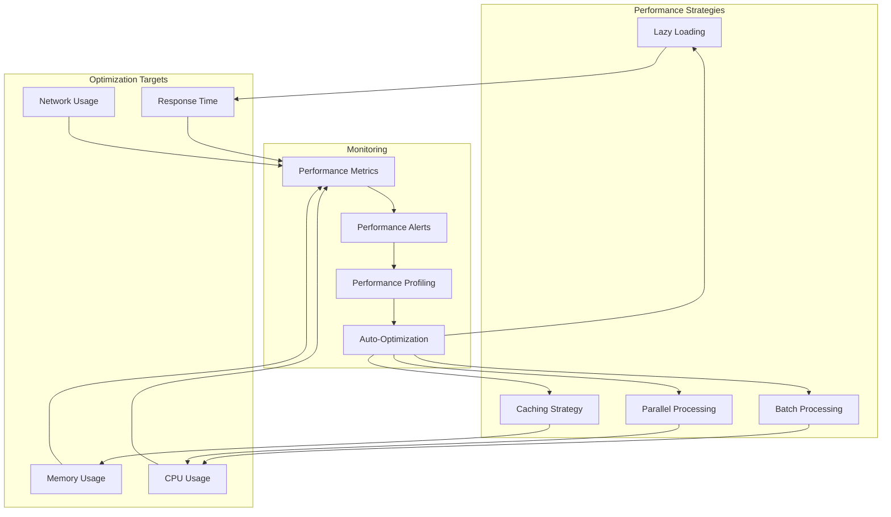

## User Behavior Learning System

### Behavior Tracking Architecture

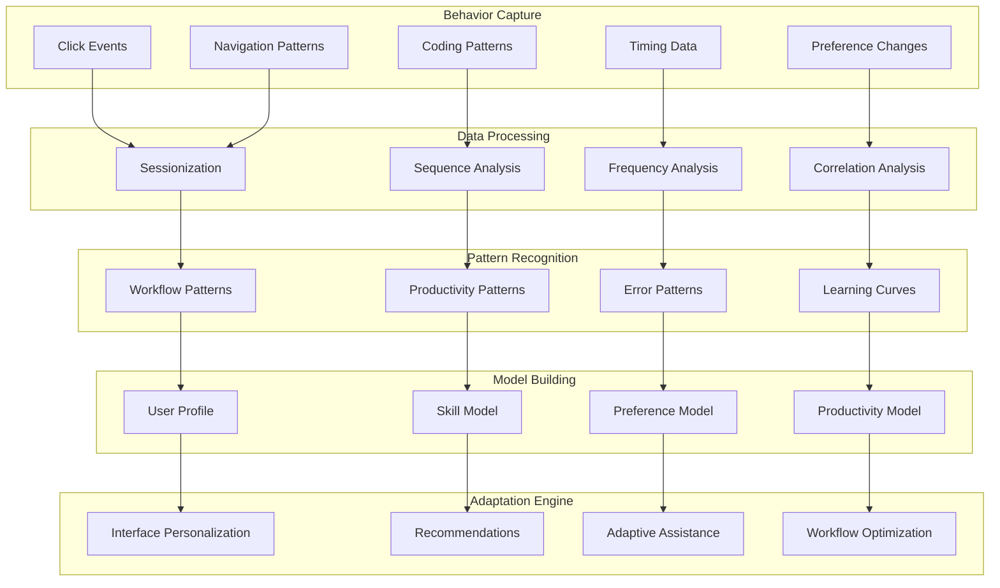

### Personalization Engine

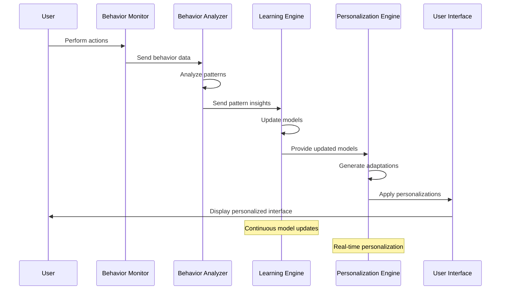

## Production Monitoring Architecture

### Monitoring Stack Integration

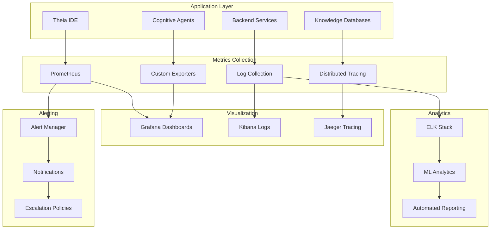

### Health Check System

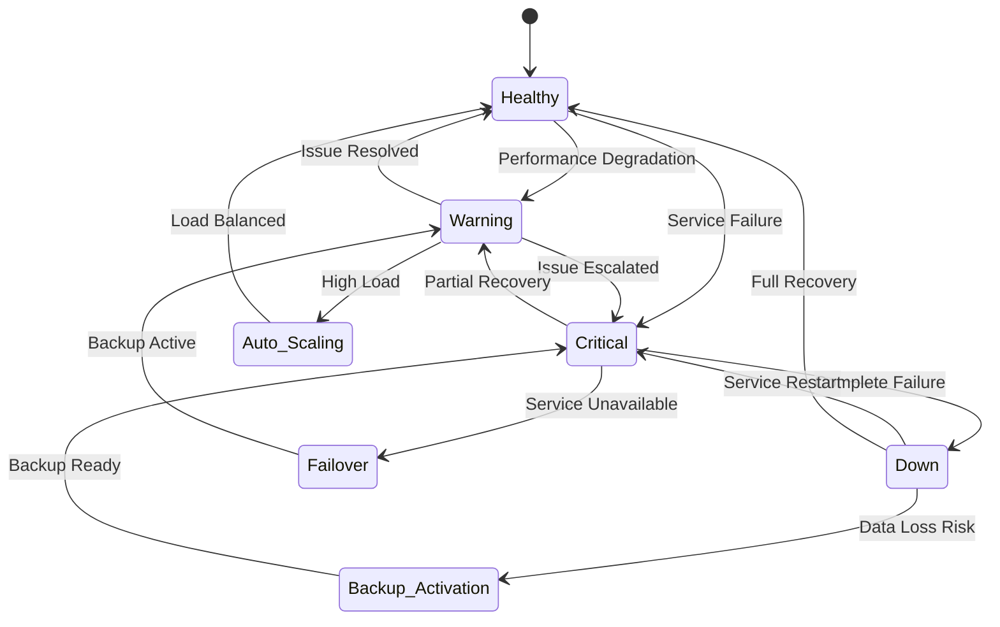

This comprehensive set of diagrams provides detailed insights into the AI-OpenCog architecture, covering all major components, interactions, and operational aspects of the system.