# Cognitive Processing Architecture

This document details the cognitive processing architecture of the AI-OpenCog system, focusing on how cognitive AI capabilities are integrated throughout the Theia IDE.

## Cognitive Processing Overview

The AI-OpenCog system implements a sophisticated cognitive processing pipeline that enables intelligent code analysis, learning, and adaptation capabilities.

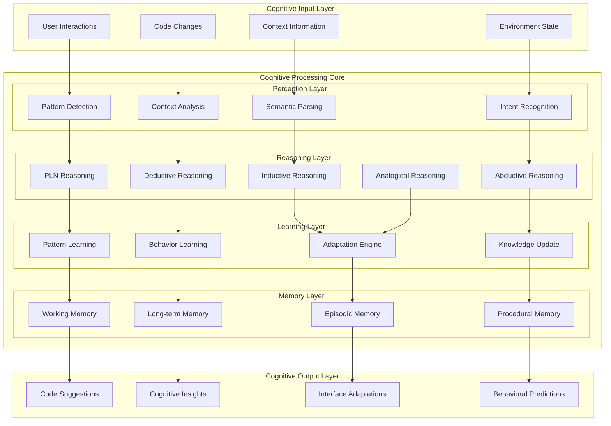

## Cognitive Agent Architecture

### Agent Cognitive Cycle

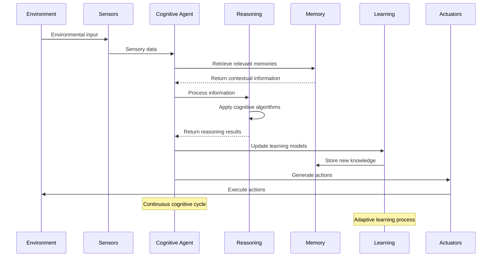

### Multi-Agent Cognitive System

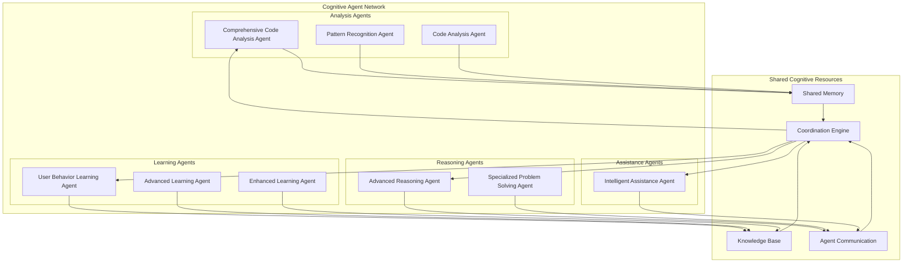

## Reasoning Engine Architecture

### PLN (Probabilistic Logic Networks) Implementation

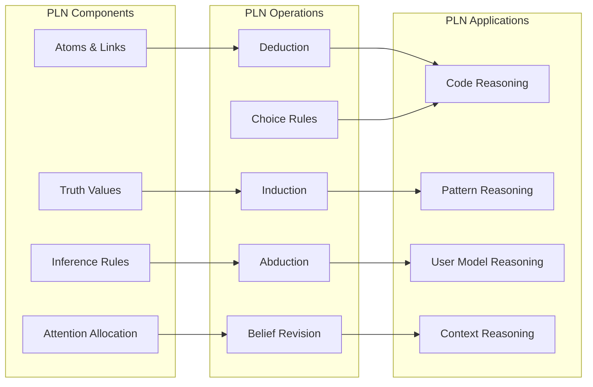

### Pattern Matching Engine

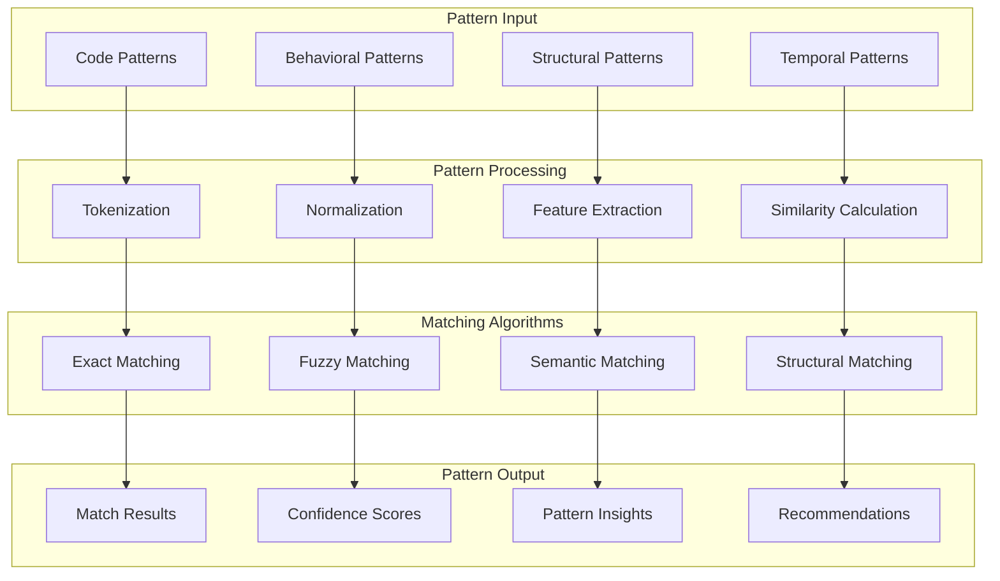

## Learning System Architecture

### Advanced Learning Algorithms

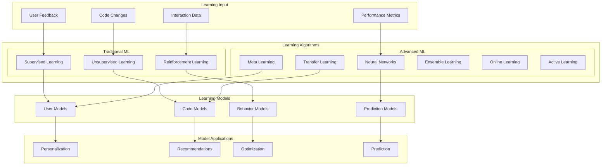

### Continuous Learning Pipeline

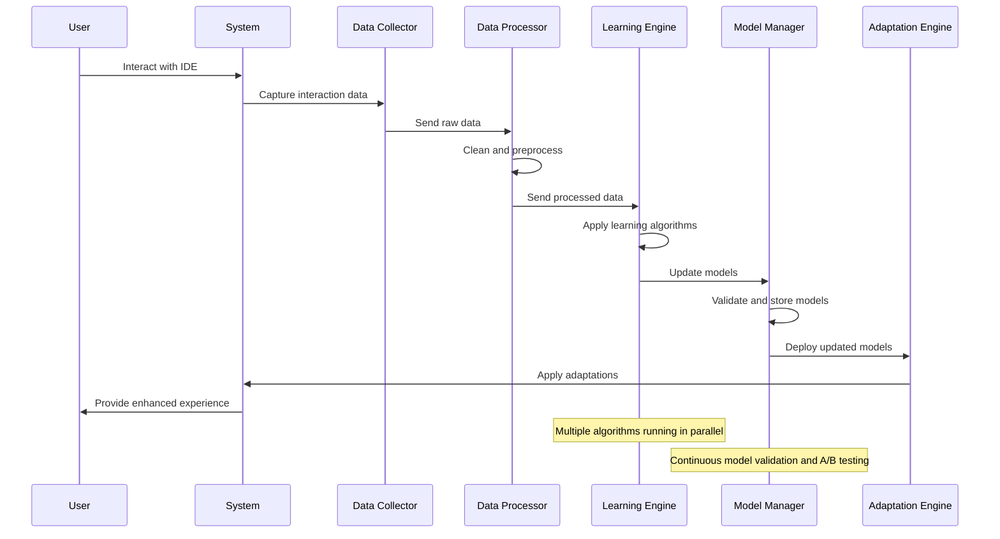

## Knowledge Management System

### Knowledge Graph Architecture

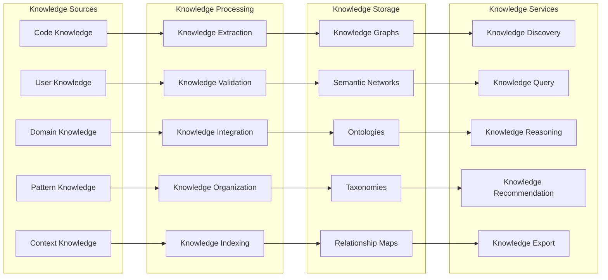

### AtomSpace Integration

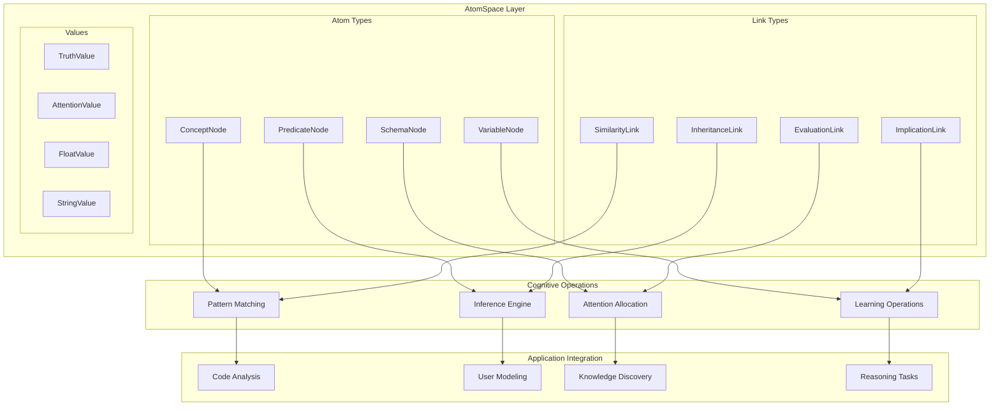

## Real-Time Cognitive Processing

### Real-Time Analysis Pipeline

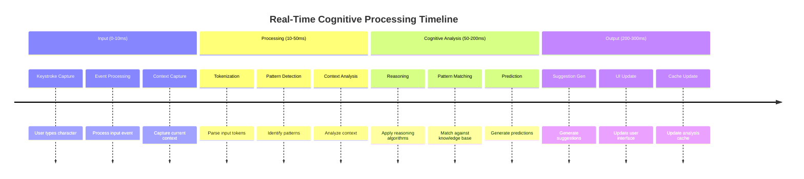

### Performance Optimization

```mermaid
graph TB
    subgraph "Optimization Strategies"
        subgraph "Computational Optimization"
            LAZY_EVAL[Lazy Evaluation]
            MEMOIZATION[Memoization]
            PARALLEL_PROC[Parallel Processing]
            BATCH_PROC[Batch Processing]
        end
        
        subgraph "Memory Optimization"
            CACHE_MGMT[Cache Management]
            MEMORY_POOL[Memory Pooling]
            GC_OPT[GC Optimization]
            DATA_STRUCT[Efficient Data Structures]
        end
        
        subgraph "I/O Optimization"
            ASYNC_IO[Async I/O]
            CONN_POOL[Connection Pooling]
            DATA_COMPRESS[Data Compression]
            PREFETCH[Prefetching]
        end
    end
    
    subgraph "Performance Monitoring"
        METRICS[Performance Metrics]
        PROFILING[Performance Profiling]
        BOTTLENECK[Bottleneck Detection]
        AUTO_OPT[Auto-Optimization]
    end
    
    LAZY_EVAL --> METRICS
    MEMOIZATION --> METRICS
    PARALLEL_PROC --> PROFILING
    BATCH_PROC --> PROFILING
    
    CACHE_MGMT --> BOTTLENECK
    MEMORY_POOL --> BOTTLENECK
    GC_OPT --> AUTO_OPT
    DATA_STRUCT --> AUTO_OPT
    
    ASYNC_IO --> METRICS
    CONN_POOL --> PROFILING
    DATA_COMPRESS --> BOTTLENECK
    PREFETCH --> AUTO_OPT
```

## Cognitive Integration Points

### IDE Integration Architecture

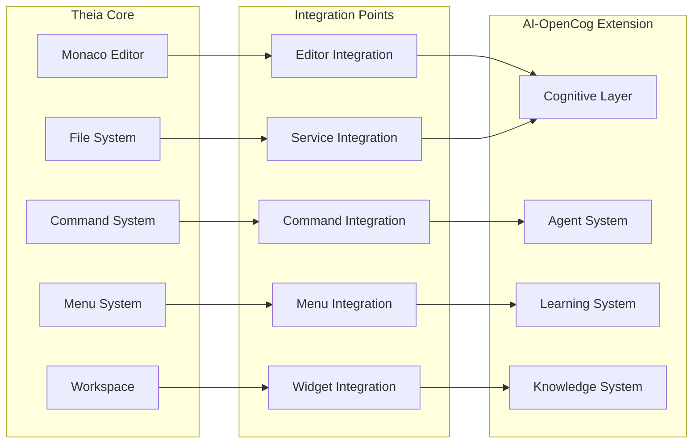

This cognitive processing architecture provides the foundation for intelligent, adaptive, and learning-capable development environment that enhances developer productivity through sophisticated AI capabilities.