# Deployment and Infrastructure Architecture

This document outlines the deployment and infrastructure architecture for the AI-OpenCog system, covering containerization, orchestration, monitoring, and production considerations.

## Infrastructure Overview

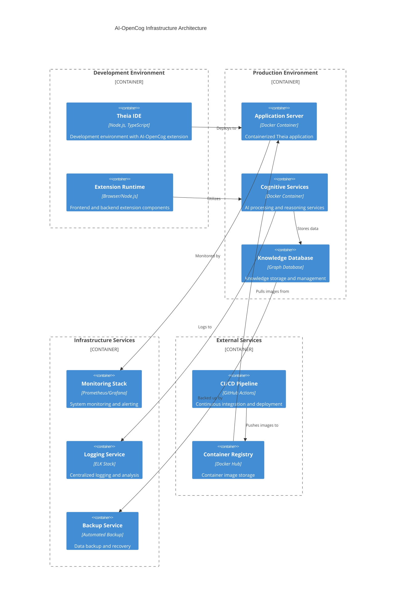

## Container Architecture

### Docker Container Structure

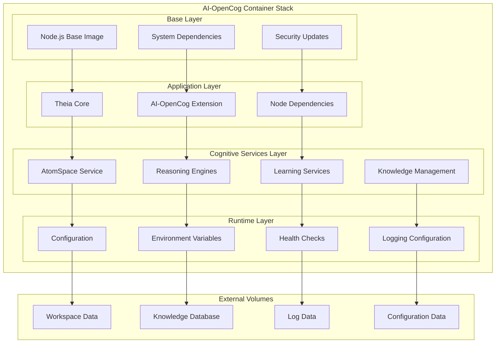

### Multi-Container Deployment

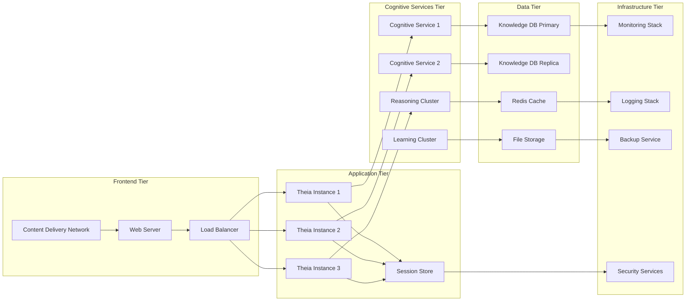

## Orchestration Architecture

### Kubernetes Deployment

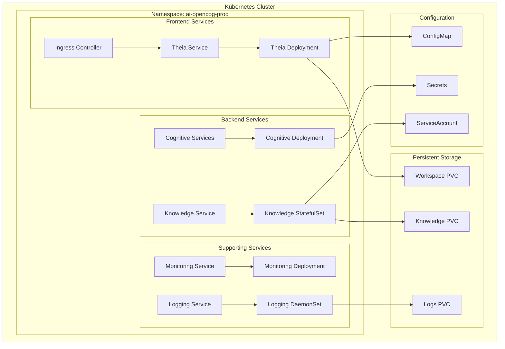

### Docker Compose Development

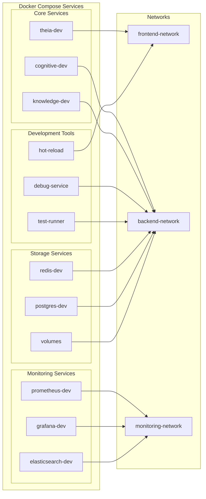

## Monitoring and Observability

### Monitoring Stack Architecture

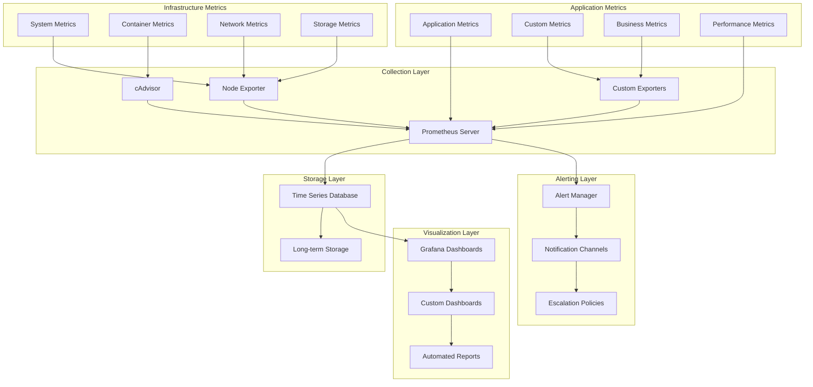

### Logging Architecture

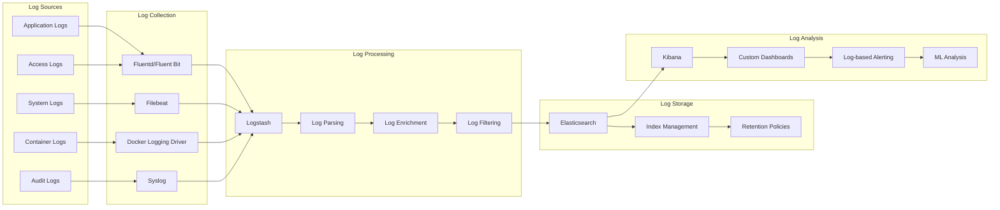

## Scalability Architecture

### Horizontal Scaling Strategy

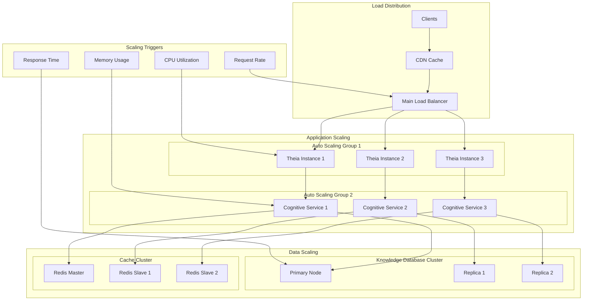

### Vertical Scaling Considerations

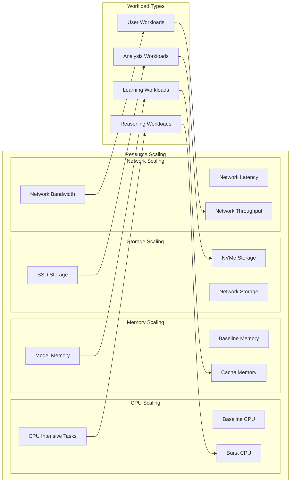

## Security Architecture

### Security Layers

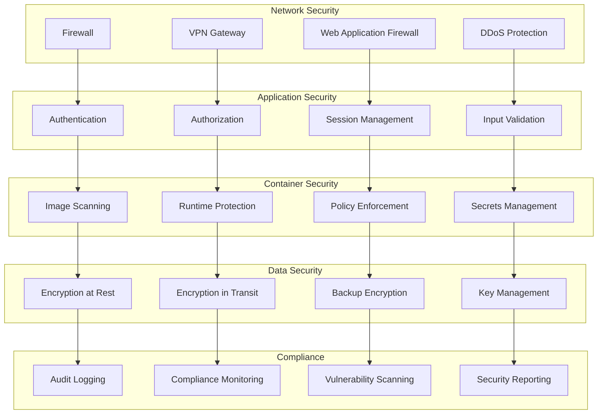

## Disaster Recovery and Backup

### Backup Strategy

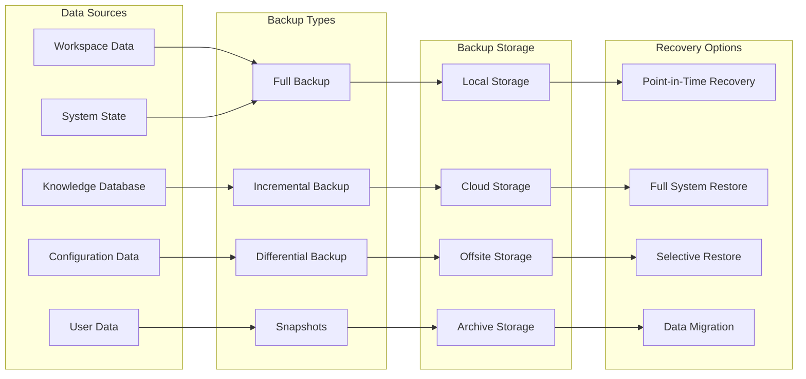

### Disaster Recovery Plan

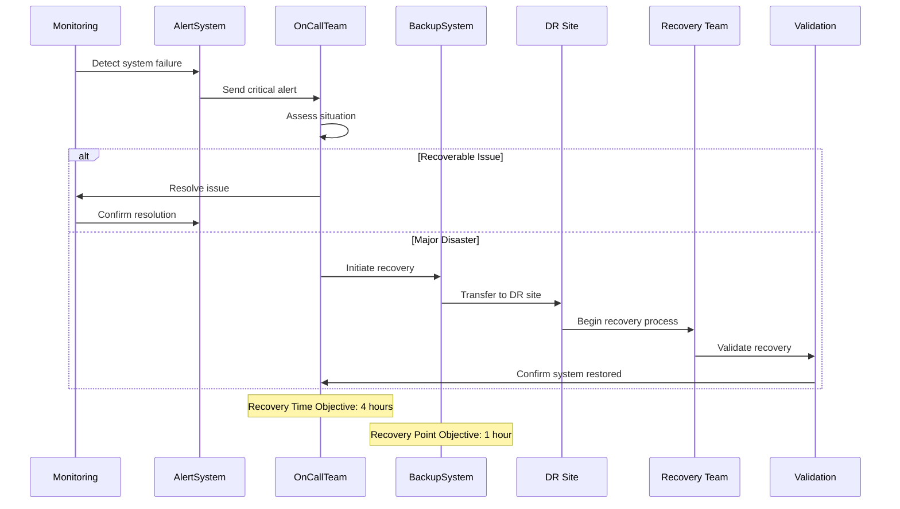

This comprehensive deployment and infrastructure architecture ensures the AI-OpenCog system can be deployed, scaled, monitored, and maintained effectively in production environments while maintaining high availability, security, and performance standards.