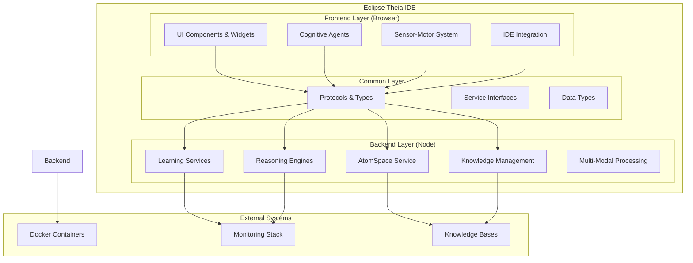
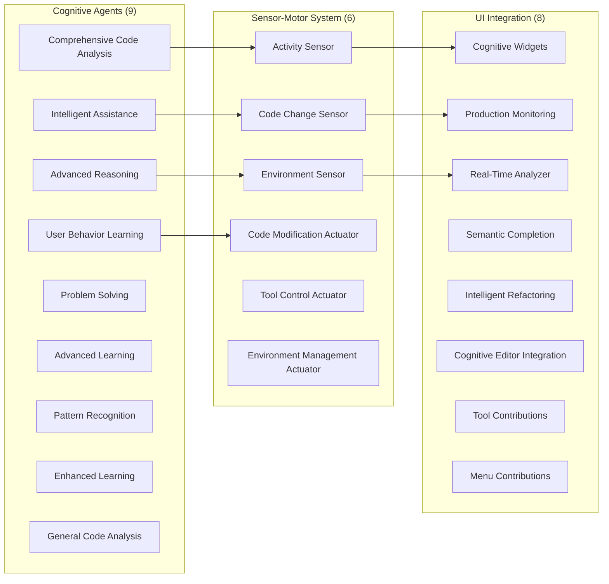
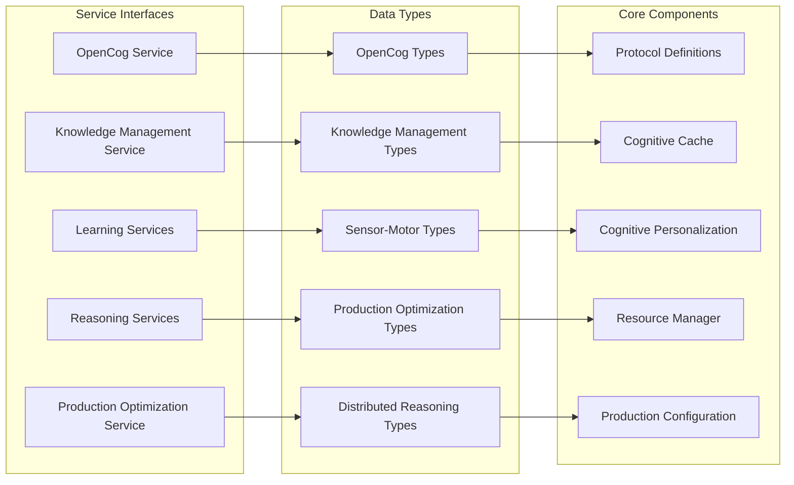
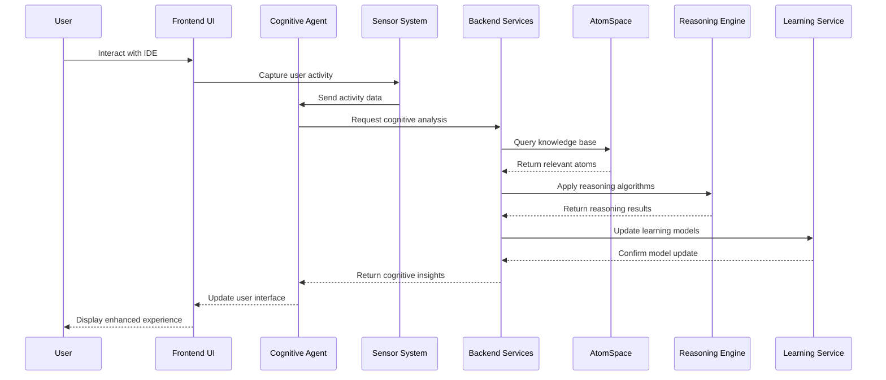
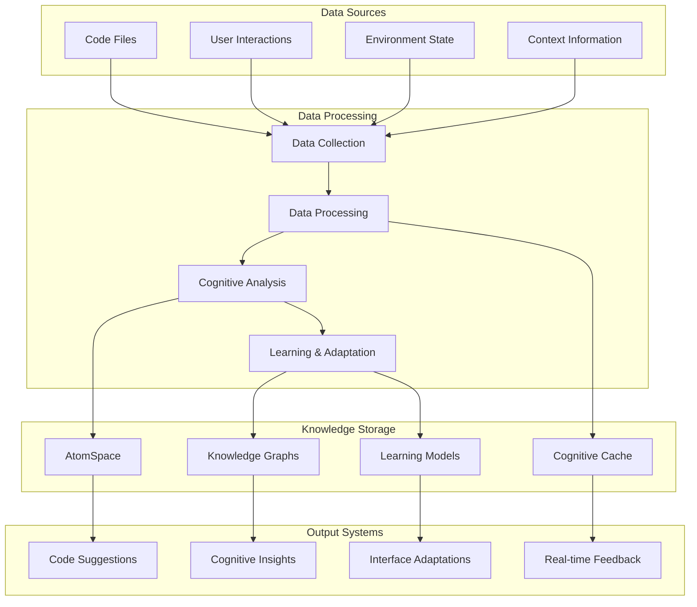
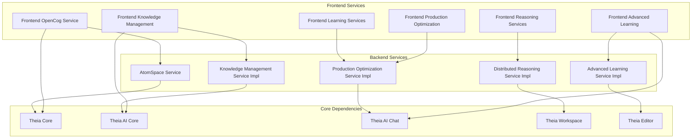
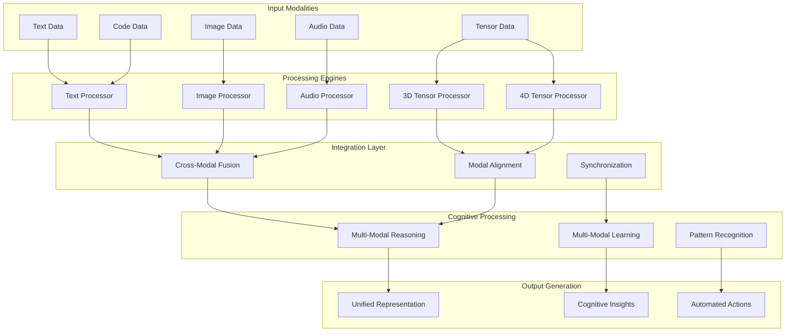
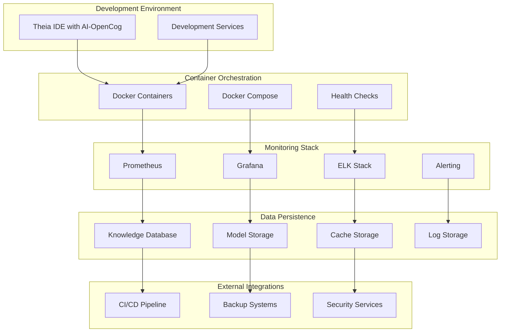

# AI-OpenCog Technical Architecture

## Overview

The AI-OpenCog extension provides a comprehensive cognitive AI framework for Eclipse Theia, implementing sophisticated cognitive reasoning, learning, and adaptation capabilities. The architecture follows a three-layer design with clear separation of concerns and extensive cognitive processing capabilities.

## System Architecture

## Architecture Layers

### 1. Frontend Layer (Browser)

The frontend layer provides the user interface and cognitive interaction capabilities.

### 2. Backend Layer (Node)

The backend layer implements the core cognitive processing and AI services.

```mermaid
graph TB
    subgraph "Core Services"
        AS[AtomSpace Service]
        KMS[Knowledge Management Service]
        POS[Production Optimization Service]
        SIS[System Integration Service]
    end
    
    subgraph "Reasoning Engines"
        PLN[PLN Reasoning Engine]
        PME[Pattern Matching Engine]
        CARE[Code Analysis Reasoning Engine]
        DRS[Deductive Reasoning Service]
        IRS[Inductive Reasoning Service]
        ARS[Abductive Reasoning Service]
    end
    
    subgraph "Learning Services"
        SLS[Supervised Learning Service]
        ULS[Unsupervised Learning Service]
        RLS[Reinforcement Learning Service]
        ALS[Advanced Learning Service]
        MMP[Multi-Modal Processing]
    end
    
    subgraph "Specialized Services"
        DRS2[Distributed Reasoning Service]
        RNW[Reasoning Node Worker]
        CAA[Code Analysis Agent]
    end
    
    AS --> PLN
    AS --> PME
    AS --> CARE
    
    KMS --> DRS
    KMS --> IRS
    KMS --> ARS
    
    POS --> SLS
    POS --> ULS
    POS --> RLS
    POS --> ALS
    
    SIS --> DRS2
    SIS --> RNW
    SIS --> CAA
```

### 3. Common Layer

The common layer defines shared interfaces, types, and protocols.

## Cognitive Processing Pipeline

## Data Flow Architecture

## Service Dependencies

## Multi-Modal Processing Architecture

## Production Deployment Architecture

## Key Design Principles

### 1. **Cognitive First Design**
- All components designed with cognitive processing capabilities
- Reasoning, learning, and adaptation built into core architecture
- Multi-modal data processing throughout the system

### 2. **Layered Architecture**
- Clear separation between frontend, common, and backend layers
- Well-defined service interfaces and protocols
- Dependency injection for loose coupling

### 3. **Extensible Agent System**
- 9 specialized cognitive agents for different domains
- Sensor-motor system for environment interaction
- Plugin architecture for easy extension

### 4. **Production Ready**
- Docker containerization for deployment
- Comprehensive monitoring and observability
- Performance optimization and caching strategies

### 5. **Real-Time Processing**
- Live code analysis and feedback
- Real-time user behavior learning
- Immediate cognitive insights and suggestions

## Performance Characteristics

- **Scalability**: Distributed reasoning across multiple nodes
- **Responsiveness**: Sub-second cognitive analysis responses
- **Adaptability**: Continuous learning from user interactions
- **Reliability**: Comprehensive error handling and fallback mechanisms
- **Efficiency**: Advanced caching and optimization strategies

## Technology Stack

- **Frontend**: TypeScript, Theia Framework, React (for widgets)
- **Backend**: Node.js, TypeScript, OpenCog integration
- **Communication**: JSON-RPC, WebSockets for real-time updates
- **Storage**: AtomSpace, Knowledge Graphs, Learning Model persistence
- **Deployment**: Docker, Docker Compose, Container orchestration
- **Monitoring**: Prometheus, Grafana, ELK Stack

This architecture provides a comprehensive cognitive AI platform that enhances developer productivity through intelligent assistance, advanced reasoning, and continuous learning capabilities.