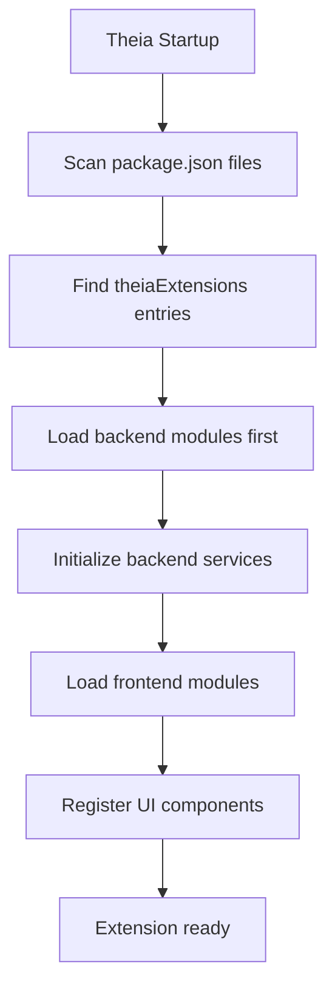

# AI-OpenCog Theia IDE Integration Guide

This comprehensive guide explains how to integrate the ai-opencog package into the Theia IDE, covering package format requirements, file organization, Theia's extension loading mechanism, and step-by-step integration instructions.

## Table of Contents

1. [Overview](#overview)
2. [Package Format Requirements](#package-format-requirements)
3. [File Organization and Structure](#file-organization-and-structure)
4. [How Theia Loads Extensions](#how-theia-loads-extensions)
5. [Prerequisites](#prerequisites)
6. [Installation and Integration](#installation-and-integration)
7. [Configuration](#configuration)
8. [Usage Examples](#usage-examples)
9. [Troubleshooting](#troubleshooting)
10. [Advanced Topics](#advanced-topics)

## Overview

The `@theia/ai-opencog` package is a comprehensive Theia extension that integrates OpenCog AI capabilities into the Theia IDE. It provides cognitive AI features including advanced reasoning, pattern recognition, learning algorithms, and intelligent assistance for developers.

**Key Features:**
- 🧠 Advanced reasoning engines (PLN, pattern matching, code analysis)
- 📊 Multi-modal cognitive processing with tensor operations
- 🤖 Intelligent assistance agents with context-aware support
- 📈 User behavior learning and adaptive personalization
- 🔍 Real-time cognitive code analysis and feedback
- 🏗️ Production-ready deployment with monitoring and optimization

## Package Format Requirements

### Theia Extension Structure

The ai-opencog package follows the standard Theia extension format with specific requirements:

#### 1. Package.json Configuration

```json
{
  "name": "@theia/ai-opencog",
  "version": "1.64.0",
  "description": "Theia - OpenCog AI Integration",
  "dependencies": {
    "@theia/ai-chat": "1.64.0",
    "@theia/ai-core": "1.64.0",
    "@theia/core": "1.64.0",
    "@theia/workspace": "1.64.0",
    "@theia/editor": "1.64.0",
    "@theia/filesystem": "1.64.0",
    "@theia/monaco": "1.64.0",
    "@theia/variable-resolver": "1.64.0",
    "tslib": "^2.6.2"
  },
  "main": "lib/common",
  "theiaExtensions": [
    {
      "frontend": "lib/browser/ai-opencog-frontend-module",
      "backend": "lib/node/ai-opencog-backend-module"
    }
  ],
  "keywords": [
    "theia-extension",
    "ai",
    "opencog",
    "cognitive-science"
  ],
  "license": "EPL-2.0 OR GPL-2.0-only WITH Classpath-exception-2.0"
}
```

#### 2. Required Dependencies

The package requires these essential Theia dependencies:

- **@theia/core**: Core Theia framework functionality
- **@theia/ai-core**: Theia AI framework integration
- **@theia/ai-chat**: AI chat capabilities
- **@theia/workspace**: Workspace management
- **@theia/editor**: Code editor integration
- **@theia/monaco**: Monaco editor extensions
- **@theia/filesystem**: File system operations
- **@theia/variable-resolver**: Variable resolution services

#### 3. Extension Entry Points

The `theiaExtensions` field defines the extension entry points:

```json
"theiaExtensions": [
  {
    "frontend": "lib/browser/ai-opencog-frontend-module",
    "backend": "lib/node/ai-opencog-backend-module"
  }
]
```

## File Organization and Structure

### Source Code Structure

```
src/
├── browser/                          # Frontend components
│   ├── ai-opencog-frontend-module.ts # Main frontend module
│   ├── cognitive-widgets/            # UI components
│   ├── intelligent-assistance-agent.ts
│   ├── user-behavior-learning-agent.ts
│   ├── comprehensive-code-analysis-agent.ts
│   ├── advanced-reasoning-agent.ts
│   ├── cognitive-editor-integration.ts
│   └── real-time-analyzer.ts
├── node/                             # Backend services
│   ├── ai-opencog-backend-module.ts  # Main backend module
│   ├── opencog-service.ts            # Core OpenCog service
│   ├── atomspace-service.ts          # AtomSpace operations
│   ├── reasoning-engines.ts          # Reasoning capabilities
│   ├── learning-services.ts          # Learning algorithms
│   ├── knowledge-management.ts       # Knowledge management
│   └── production-monitoring.ts      # Production monitoring
├── common/                           # Shared interfaces and types
│   ├── index.ts                      # Main exports
│   ├── opencog-types.ts             # Type definitions
│   ├── protocol.ts                   # Communication protocol
│   ├── sensor-motor-types.ts        # Sensor/motor interfaces
│   └── knowledge-management-types.ts # Knowledge types
└── test/                            # Test files
    ├── browser/                     # Frontend tests
    ├── node/                        # Backend tests
    └── common/                      # Shared test utilities
```

### Build Output Structure

After compilation, the extension generates:

```
lib/
├── browser/                         # Compiled frontend code
│   ├── ai-opencog-frontend-module.js
│   └── [other frontend files]
├── node/                           # Compiled backend code
│   ├── ai-opencog-backend-module.js
│   └── [other backend files]
└── common/                         # Compiled shared code
    ├── index.js
    └── [other common files]
```

### Key File Locations

| Component | Location | Purpose |
|-----------|----------|---------|
| **Frontend Module** | `lib/browser/ai-opencog-frontend-module.js` | Main browser-side entry point |
| **Backend Module** | `lib/node/ai-opencog-backend-module.js` | Main Node.js-side entry point |
| **Common Exports** | `lib/common/index.js` | Shared interfaces and types |
| **Configuration** | `package.json` | Extension metadata and dependencies |
| **Type Definitions** | `lib/common/opencog-types.d.ts` | TypeScript type definitions |

## How Theia Loads Extensions

### Extension Discovery

Theia discovers extensions through several mechanisms:

1. **Package.json Scanning**: Theia scans for packages with `theiaExtensions` field
2. **Dependency Resolution**: Extensions are loaded based on npm dependency graph
3. **Module Loading**: Entry points specified in `theiaExtensions` are loaded

### Loading Process



### Module Registration

1. **Backend Module Loading**:
   ```typescript
   // lib/node/ai-opencog-backend-module.js
   export default new ContainerModule(bind => {
     bind(OpenCogService).toSelf().inSingletonScope();
     bind(AtomSpaceService).toSelf().inSingletonScope();
     bind(ReasoningEngines).toSelf().inSingletonScope();
     // ... other service bindings
   });
   ```

2. **Frontend Module Loading**:
   ```typescript
   // lib/browser/ai-opencog-frontend-module.js
   export default new ContainerModule(bind => {
     bind(IntelligentAssistanceAgent).toSelf().inSingletonScope();
     bind(UserBehaviorLearningAgent).toSelf().inSingletonScope();
     bind(CognitiveEditorIntegration).toSelf().inSingletonScope();
     // ... other component bindings
   });
   ```

### Service Registration

Extensions register services using Theia's dependency injection container:

```typescript
// Backend service registration
bind(OpenCogService).toSelf().inSingletonScope();
bind(Symbol.for('OpenCogService')).toService(OpenCogService);

// Frontend component registration  
bind(CommandContribution).toService(OpenCogCommandContribution);
bind(MenuContribution).toService(OpenCogMenuContribution);
bind(WidgetFactory).toService(CognitiveWidgetFactory);
```

## Prerequisites

### System Requirements

- **Node.js**: Version 16.x or 18.x
- **npm**: Version 8.x or higher
- **Python**: Version 3.8+ (for OpenCog backend)
- **Operating System**: Linux, macOS, or Windows (with WSL2)

### Theia Development Environment

1. **Theia Version**: 1.64.0 or compatible
2. **Required Theia Packages**:
   ```bash
   npm install @theia/core@1.64.0
   npm install @theia/ai-core@1.64.0
   npm install @theia/ai-chat@1.64.0
   ```

### OpenCog Dependencies

```bash
# Ubuntu/Debian
sudo apt-get install opencog opencog-dev

# macOS with Homebrew
brew install opencog

# Or build from source
git clone https://github.com/opencog/opencog
cd opencog && mkdir build && cd build
cmake .. && make -j4 && sudo make install
```

## Installation and Integration

### Method 1: NPM Package Installation

1. **Install the package**:
   ```bash
   npm install @theia/ai-opencog@1.64.0
   ```

2. **Add to your Theia application**:
   ```json
   // package.json dependencies
   {
     "dependencies": {
       "@theia/ai-opencog": "1.64.0"
     }
   }
   ```

3. **Rebuild your Theia application**:
   ```bash
   npm run build
   ```

### Method 2: Local Development Integration

1. **Clone or copy the ai-opencog package**:
   ```bash
   cp -r path/to/ai-opencog /your-theia-workspace/packages/
   ```

2. **Install dependencies**:
   ```bash
   cd /your-theia-workspace/packages/ai-opencog
   npm install
   ```

3. **Build the extension**:
   ```bash
   npm run compile
   ```

4. **Link to your Theia application**:
   ```bash
   cd /your-theia-workspace
   npm install ./packages/ai-opencog
   ```

### Method 3: Workspace Integration

1. **Add to your Theia workspace**:
   ```json
   // lerna.json or workspace configuration
   {
     "packages": [
       "packages/*",
       "packages/ai-opencog"
     ]
   }
   ```

2. **Install and build**:
   ```bash
   npm run build
   # or with lerna
   lerna run build
   ```

## Configuration

### Basic Configuration

Create a configuration file for the ai-opencog extension:

```json
// config/ai-opencog.json
{
  "opencog": {
    "enabled": true,
    "atomspace": {
      "maxSize": 1000000,
      "persistence": true
    },
    "reasoning": {
      "engines": ["pln", "pattern-matching", "code-analysis"],
      "defaultEngine": "pln"
    },
    "learning": {
      "algorithms": ["supervised", "reinforcement", "meta-learning"],
      "userBehaviorTracking": true,
      "personalization": true
    },
    "agents": {
      "intelligentAssistance": true,
      "codeAnalysis": true,
      "behaviorLearning": true,
      "reasoning": true
    }
  }
}
```

### Environment Variables

```bash
# OpenCog configuration
export OPENCOG_ATOMSPACE_SIZE=1000000
export OPENCOG_REASONING_ENGINE=pln
export OPENCOG_LEARNING_ENABLED=true

# Theia AI configuration
export THEIA_AI_OPENCOG_ENABLED=true
export THEIA_AI_OPENCOG_DEBUG=false
```

### Advanced Configuration

```typescript
// src/common/opencog-config.ts
export interface OpenCogConfiguration {
  atomspace: {
    maxSize: number;
    persistence: boolean;
    storageType: 'memory' | 'postgres' | 'rocksdb';
  };
  reasoning: {
    engines: string[];
    defaultEngine: string;
    confidence: {
      threshold: number;
      updateRate: number;
    };
  };
  learning: {
    algorithms: string[];
    userBehaviorTracking: boolean;
    modelPersistence: boolean;
    adaptationRate: number;
  };
  agents: {
    [agentName: string]: {
      enabled: boolean;
      priority: number;
      configuration: any;
    };
  };
  production: {
    monitoring: boolean;
    optimization: boolean;
    caching: boolean;
    performance: {
      maxMemoryUsage: string;
      maxCpuUsage: number;
    };
  };
}
```

## Usage Examples

### Basic Usage

1. **Initialize OpenCog Service**:
   ```typescript
   import { OpenCogService } from '@theia/ai-opencog/lib/common';
   
   // In your Theia component
   @inject(OpenCogService)
   private readonly openCogService: OpenCogService;
   
   async initializeOpenCog() {
     await this.openCogService.initialize();
     console.log('OpenCog service initialized');
   }
   ```

2. **Use Intelligent Assistance**:
   ```typescript
   import { IntelligentAssistanceAgent } from '@theia/ai-opencog/lib/browser';
   
   @inject(IntelligentAssistanceAgent)
   private readonly assistanceAgent: IntelligentAssistanceAgent;
   
   async getCodeSuggestion(code: string, context: string) {
     const suggestion = await this.assistanceAgent.getContextualHelp(
       code, 
       context, 
       { includeExplanation: true }
     );
     return suggestion;
   }
   ```

### Advanced Usage

1. **Custom Reasoning Engine**:
   ```typescript
   import { ReasoningEngines } from '@theia/ai-opencog/lib/node';
   
   // Create custom reasoning query
   const reasoningResult = await this.reasoningEngines.performReasoning(
     'code-analysis',
     {
       type: 'semantic-analysis',
       target: codeBlock,
       context: workspaceContext,
       goals: ['optimization', 'maintainability']
     }
   );
   ```

2. **User Behavior Learning**:
   ```typescript
   import { UserBehaviorLearningAgent } from '@theia/ai-opencog/lib/browser';
   
   // Track user behavior
   await this.behaviorAgent.trackUserAction({
     action: 'code-completion-accepted',
     context: editorContext,
     timestamp: Date.now(),
     metadata: { language: 'typescript', confidence: 0.95 }
   });
   
   // Get personalized recommendations
   const recommendations = await this.behaviorAgent.getPersonalizedRecommendations(
     userId,
     currentContext
   );
   ```

3. **Knowledge Management**:
   ```typescript
   import { KnowledgeManagementService } from '@theia/ai-opencog/lib/common';
   
   // Create knowledge graph
   await this.knowledgeService.createKnowledgeGraph('project-architecture', {
     entities: projectEntities,
     relationships: projectRelationships,
     metadata: { domain: 'software-engineering' }
   });
   
   // Query knowledge
   const insights = await this.knowledgeService.queryKnowledge({
     query: 'find patterns in codebase',
     context: workspaceUri,
     filters: { type: 'design-pattern' }
   });
   ```

### Integration with Monaco Editor

```typescript
import { CognitiveEditorIntegration } from '@theia/ai-opencog/lib/browser';

// Enable real-time cognitive analysis
const cognitiveIntegration = new CognitiveEditorIntegration(
  monacoEditor,
  openCogService
);

// Configure real-time analysis
cognitiveIntegration.enableRealTimeAnalysis({
  debounceTime: 500,
  analysisTypes: ['semantic', 'structural', 'behavioral'],
  visualDecorations: true,
  contextualHints: true
});

// Add cognitive decorations
editor.onDidChangeModelContent(() => {
  cognitiveIntegration.analyzeCurrentContext()
    .then(analysis => {
      cognitiveIntegration.applyVisualDecorations(analysis);
    });
});
```

## Troubleshooting

### Common Issues

#### 1. Extension Not Loading

**Problem**: ai-opencog extension doesn't appear in Theia

**Solutions**:
- Verify `theiaExtensions` field in package.json
- Check that compiled files exist in `lib/` directory
- Ensure Theia version compatibility (1.64.0)
- Rebuild the extension: `npm run compile`

#### 2. OpenCog Service Connection Errors

**Problem**: Cannot connect to OpenCog backend

**Solutions**:
```bash
# Check OpenCog installation
opencog --version

# Verify Python bindings
python -c "import opencog; print('OpenCog available')"

# Check environment variables
echo $OPENCOG_ATOMSPACE_SIZE
```

#### 3. Memory Usage Issues

**Problem**: High memory consumption

**Solutions**:
```json
// Reduce AtomSpace size
{
  "opencog": {
    "atomspace": {
      "maxSize": 500000
    },
    "production": {
      "performance": {
        "maxMemoryUsage": "2GB"
      }
    }
  }
}
```

#### 4. TypeScript Compilation Errors

**Problem**: Build fails with TypeScript errors

**Solutions**:
- Ensure compatible TypeScript version: `npm install typescript@4.9.x`
- Check tsconfig.json compatibility
- Verify all dependencies are installed
- Clean and rebuild: `npm run clean && npm run compile`

### Debug Mode

Enable debug logging:

```typescript
// Set environment variable
process.env.THEIA_AI_OPENCOG_DEBUG = 'true';

// Or programmatically
import { OpenCogService } from '@theia/ai-opencog/lib/common';

const service = new OpenCogService();
service.setDebugMode(true);
```

### Performance Monitoring

Monitor extension performance:

```typescript
import { ProductionMonitoringService } from '@theia/ai-opencog/lib/node';

// Enable monitoring
const monitoring = new ProductionMonitoringService();
await monitoring.startMonitoring({
  metrics: ['memory', 'cpu', 'response-time'],
  interval: 30000, // 30 seconds
  alerts: {
    memoryThreshold: '1GB',
    cpuThreshold: 80
  }
});
```

## Advanced Topics

### Custom Agent Development

Create custom cognitive agents:

```typescript
import { CognitiveAgent } from '@theia/ai-opencog/lib/common';

export class CustomAnalysisAgent extends CognitiveAgent {
  async analyzeCode(code: string, context: any): Promise<AnalysisResult> {
    // Custom analysis logic
    const analysis = await this.performCognitiveAnalysis(code, context);
    return this.formatAnalysisResult(analysis);
  }
  
  protected async performCognitiveAnalysis(code: string, context: any) {
    // Integrate with OpenCog reasoning engines
    return await this.reasoningService.analyze(code, {
      type: 'custom-analysis',
      context: context,
      algorithms: ['pattern-matching', 'semantic-analysis']
    });
  }
}
```

### Production Deployment

Deploy with Docker:

```dockerfile
# Dockerfile for production deployment
FROM node:18-alpine

# Install OpenCog dependencies
RUN apk add --no-cache opencog opencog-dev

# Copy and build application
COPY . /app
WORKDIR /app
RUN npm install && npm run build

# Configure for production
ENV OPENCOG_ATOMSPACE_SIZE=2000000
ENV THEIA_AI_OPENCOG_PRODUCTION=true

EXPOSE 3000
CMD ["npm", "start"]
```

### Scaling and Performance

Configure for high-performance environments:

```json
{
  "opencog": {
    "production": {
      "clustering": {
        "enabled": true,
        "workers": 4
      },
      "caching": {
        "redis": {
          "host": "redis-server",
          "port": 6379
        }
      },
      "optimization": {
        "aggressiveCaching": true,
        "lazyLoading": true,
        "backgroundProcessing": true
      }
    }
  }
}
```

### Custom UI Components

Extend the cognitive interface:

```tsx
import React from 'react';
import { CognitiveWidget } from '@theia/ai-opencog/lib/browser/cognitive-widgets';

export const CustomCognitivePanel: React.FC = () => {
  return (
    <CognitiveWidget title="Custom Analysis">
      <div className="cognitive-panel">
        {/* Custom cognitive UI */}
      </div>
    </CognitiveWidget>
  );
};

// Register widget
bind(WidgetFactory).toFactory(ctx => ({
  id: 'custom-cognitive-panel',
  createWidget: () => new ReactWidget(CustomCognitivePanel)
}));
```

---

## Conclusion

This guide provides comprehensive coverage of integrating the ai-opencog package into Theia IDE. The package follows standard Theia extension patterns while providing advanced cognitive AI capabilities. For additional support, refer to the extensive documentation in the package's README files and implementation summaries.

For latest updates and community support, visit the [spec-kit repository](https://github.com/danregima/spec-kit).